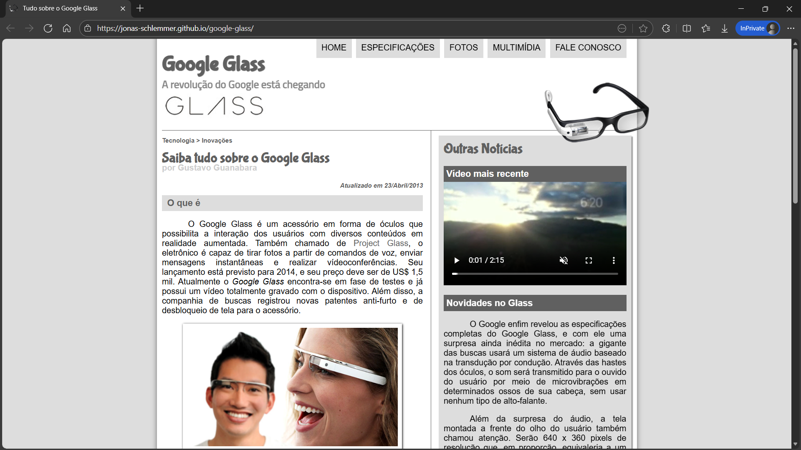
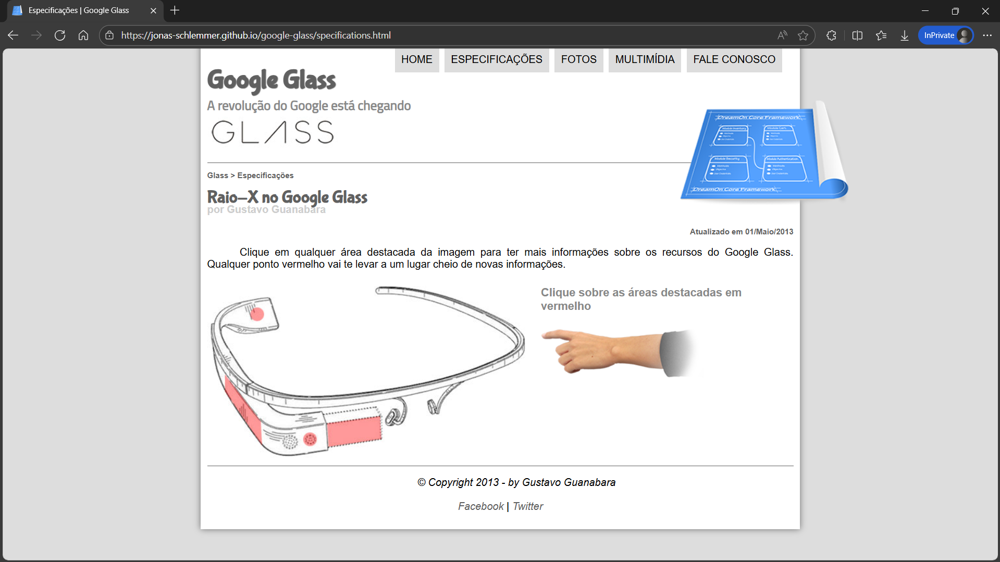
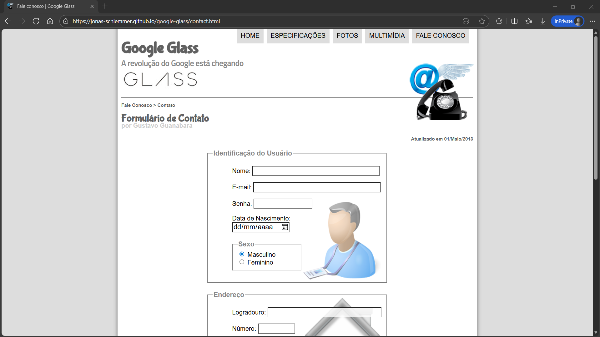

# 📝 google-glass
Projeto do Curso de HTML5 do Curso em Vídeo, ministrado pelo Gustavo Guanabara em 2013.

## 🛠️ Tecnologias
- HTML5;
- CSS3;
- JavaScript.

## ✅ Funcionalidades
- criarEditarEApagarTarefas;
- filtrosPorColuna;
- exportarParaExcel.

## 🖼️ Telas

## 🚀 Como Executar
#### Acesso web:
https://jonas-schlemmer.github.io/google-glass/

## 👤 Autores
- [Jonas Schlemmer](https://github.com/jonas-schlemmer)
